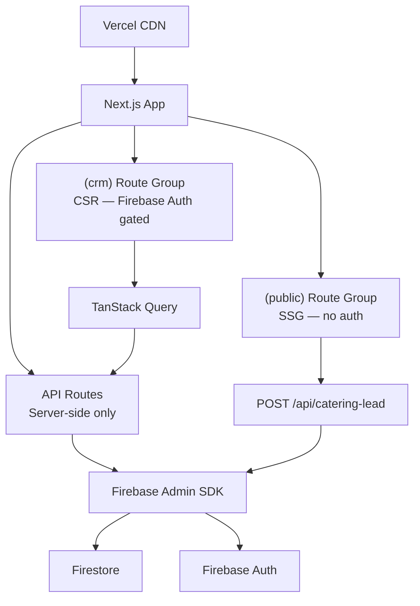
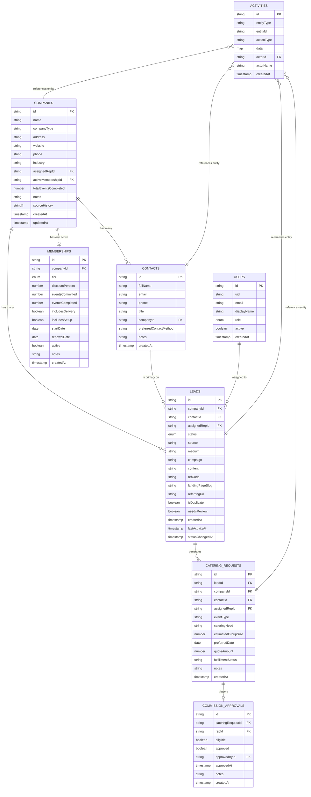
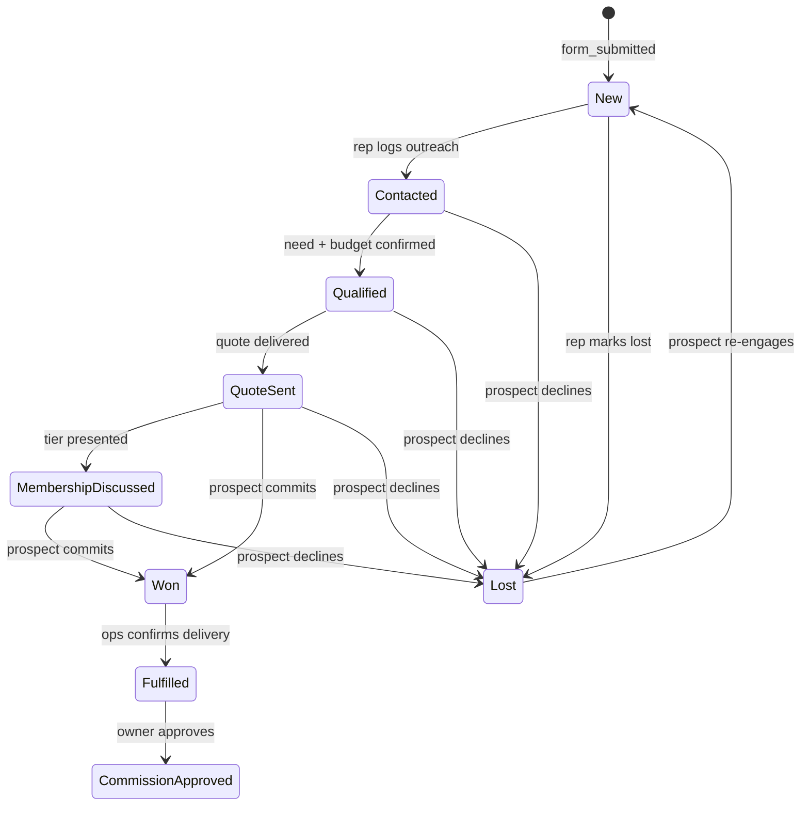

# Buddas Catering CRM — Implementation Plan

> PHASE 0: Repo + Architecture Audit  
> Status: ✅ Audit complete — Plan ready for review  
> Date: March 2026

---

## 1. Repo Audit Summary

### What Was Found

| Item | Finding |
|------|---------|
| Existing code | ❌ None. Blank slate. |
| Existing config | ❌ No `package.json`, no Next.js, no Firebase, no Tailwind |
| Existing design | ❌ No Figma, no CSS, no media assets |
| PRD document | ✅ [Buddas_Catering_CRM_PRD_Elevated_v3.docx.md](file:///Users/mimac/WORK/catering%20website/Buddas_Catering_CRM_PRD_Elevated_v3.docx.md) — 903 lines, fully read |
| CLAUDE.md | ✅ Created fresh (see [/Users/mimac/WORK/catering website/CLAUDE.md](file:///Users/mimac/WORK/catering%20website/CLAUDE.md)) |

**Verdict:** This is a greenfield project starting from a well-specified PRD. No legacy code to preserve. We own every architectural decision.

---

## 2. Proposed Architecture

### Decision: One Next.js App, Two Surfaces

A single Next.js 14 monorepo serves both the public landing page and the internal CRM. This is simpler to maintain than two separate deployments and avoids environment variable duplication.

**Trade-off recorded:** The CRM adds auth middleware overhead for the public route. Mitigated by using route groups (`(public)` vs `(crm)`) so the auth middleware only runs on `/app/*` prefixed routes.



### Folder Structure

```
/Users/mimac/WORK/catering website/
├── CLAUDE.md               ← Project guidance for AI agents
├── Buddas_Catering_CRM_PRD_Elevated_v3.docx.md
├── package.json
├── next.config.ts
├── tailwind.config.ts
├── tsconfig.json
├── firestore.rules
├── .env.local              ← Firebase keys (never commit)
└── src/
    ├── app/
    │   ├── (public)/       ← Landing page route group (SSG)
    │   │   └── page.tsx
    │   ├── (crm)/          ← Protected CRM route group
    │   │   ├── layout.tsx  ← Auth guard + CRM shell
    │   │   ├── app/
    │   │   │   ├── dashboard/page.tsx
    │   │   │   ├── leads/page.tsx
    │   │   │   ├── leads/[id]/page.tsx
    │   │   │   ├── companies/[id]/page.tsx
    │   │   │   ├── approvals/page.tsx
    │   │   │   └── reports/page.tsx
    │   ├── login/page.tsx
    │   └── api/
    │       ├── catering-lead/route.ts   ← Public intake
    │       ├── leads/[id]/status/route.ts
    │       ├── leads/[id]/notes/route.ts
    │       └── approvals/[id]/route.ts
    ├── components/
    │   ├── landing/
    │   │   ├── Nav.tsx
    │   │   ├── Hero.tsx
    │   │   ├── BenefitsStrip.tsx
    │   │   ├── CateringCards.tsx
    │   │   ├── MembershipTiers.tsx
    │   │   ├── SocialProof.tsx
    │   │   ├── FAQ.tsx
    │   │   ├── LeadForm.tsx
    │   │   └── SuccessState.tsx
    │   ├── crm/
    │   │   ├── Sidebar.tsx
    │   │   ├── DashboardWidget.tsx
    │   │   ├── LeadsTable.tsx
    │   │   ├── LeadDetailPanel.tsx
    │   │   ├── StatusBadge.tsx
    │   │   ├── ActivityTimeline.tsx
    │   │   ├── MembershipCard.tsx
    │   │   └── ApprovalCard.tsx
    │   └── shared/
    │       ├── Button.tsx
    │       ├── Card.tsx
    │       ├── Badge.tsx
    │       ├── Input.tsx
    │       ├── Select.tsx
    │       └── Toast.tsx
    ├── lib/
    │   ├── firebase/
    │   │   ├── config.ts        ← Client SDK init
    │   │   ├── admin.ts         ← Admin SDK (server-only)
    │   │   └── auth.ts          ← Auth helpers
    │   ├── types/
    │   │   └── index.ts         ← All TypeScript interfaces
    │   ├── schemas/
    │   │   └── intake.ts        ← Zod schemas
    │   └── utils/
    │       ├── dedup.ts         ← Duplicate detection logic
    │       ├── attribution.ts   ← UTM parsing helpers
    │       └── phone.ts         ← Phone normalization
    └── styles/
        └── globals.css          ← CSS token definitions
```

---

## 3. Data Model

### Entity Relationship Diagram



### Lead Status State Machine



---

## 4. Visual Design Artifacts

### Landing Page Wireframe (Desktop)


### CRM Wireframe (4 Screens)


### Service Blueprint


### UX Attention Heatmap


### Mobile Wireframes (3 scroll states)


---

## 5. Phase Roadmap

### PHASE 1 — Data Model + Workflow Foundation (Weeks 1–2)
**Goal:** Working Firebase project, types, schemas, auth, seed data.

Files: `src/lib/types/index.ts`, `src/lib/schemas/intake.ts`, `firestore.rules`, `src/lib/firebase/`, seed scripts.

### PHASE 2 — Landing Page (Weeks 2–3)
**Goal:** Public URL live, form submits to API, records appear in Firestore.

Critical path: attribution fields → form → `/api/catering-lead` → Firestore write → success state.

### PHASE 3 — CRM MVP (Weeks 3–6)
**Goal:** Internal team can log in, see all leads, manage pipeline, approve commissions.

Priority order: Login → Dashboard → Leads Table → Lead Detail → Approval Queue → Company Detail → Reports.

### PHASE 4 — Connected System (Weeks 6–7)
**Goal:** Form submission flows completely into CRM with activity log, rep assignment, membership tracking.

### PHASE 5 — QA + Delivery (Week 8)
**Goal:** All critical paths tested, security reviewed, mobile QA'd, team trained.

---

## 6. API Contracts

### POST /api/catering-lead (Public)

**Request:**
```typescript
{
  name: string;             // min 2 chars
  company: string;          // min 2 chars
  email: string;            // RFC 5322
  phone: string;            // US format
  eventType: string;        // from enum
  cateringNeed: string;     // Breakfast | Lunch | Pastries | Not Sure
  estimatedGroupSize: number; // min 10
  preferredDate?: string;   // ISO date, future only
  notes?: string;           // max 500 chars
  // Hidden attribution
  source?: string;
  medium?: string;
  campaign?: string;
  content?: string;
  refCode?: string;
  landingPageSlug?: string;
  referringUrl?: string;
}
```

**Success Response (200):**
```json
{ "success": true, "leadId": "abc123" }
```

**Error Response (422):**
```json
{ "success": false, "errors": [{ "field": "email", "message": "Invalid email" }] }
```

**Processing Logic:**
1. Zod validation → reject 422 if invalid
2. Normalize phone (digits only)
3. Lowercase + trim email
4. **Dedup check:**
   - Exact email match → link to existing contact
   - Phone + company match → link to existing contact
   - Fuzzy company match → create new, flag `needsReview=true`
5. Create/update: Company → Contact → Lead → CateringRequest
6. Write activity: `form_submitted`
7. Fire notification (new lead email)
8. Return `{ success: true, leadId }`

**Rate limiting:** 10 submissions per IP per hour (via middleware).

---

## 7. Security Design

> [!IMPORTANT]
> All sensitive CRM operations go through server-side API routes — never direct client Firestore writes.

| Layer | Control |
|-------|---------|
| Auth | Firebase Auth + custom claims (`role`) |
| API routes | `admin.auth().verifyIdToken()` on every protected route |
| Firestore rules | Block direct client writes on `commissionApprovals`, `activities` |
| Approval queue | Role check: only `owner` can read/write approvals |
| Status transitions | Validated server-side against state machine — not just UI guards |
| Commission immutability | Firestore rule: `approved=true` records cannot be updated or deleted |
| Activity log immutability | Firestore rule: deletes blocked on `activities` collection |
| Intake rate limiting | Next.js middleware OR Vercel Edge Config |

---

## 8. Rendering Strategy

| Surface | Mode | Why |
|---------|------|-----|
| Landing page | SSG (Static Site Generation) | Zero server latency, CDN edge, <2.5s LCP target |
| CRM shell | CSR (Client-Side Rendering) | Auth-gated, data-heavy, real-time. SSR adds auth round-trip with no SEO benefit |
| CRM data fetching | TanStack Query | Stale-while-revalidate, optimistic updates, background refetch |
| API routes | Server (Node.js) | Never exposed to client bundle |

---

## 9. Design Tokens Applied

Based on the PRD design system (Section 3) and the output from the `ui-ux-pro-max` skill:

| Token | Value | Usage |
|-------|-------|-------|
| Primary CTA bg | `#1C5F56` (Dark Teal) | Buttons, not `#54BFA5` (fails WCAG AA on white) |
| Body text | `#5A3A1F` (Cocoa Brown) | Never pure black |
| Page bg (public) | `#FFF8E8` (Buddas Cream) | Warm, premium-casual |
| Page bg (CRM) | `#F7F7F5` (CRM Gray) | Neutral, data-dense |
| Gold | `#E9C559` | Restrained: discount %, warnings only |
| Error | `#D36200` (Sunset Orange) | Errors, overdue, lost status |
| Font (headings) | Poppins 500/600 | Never bold (700) per brand guidelines |
| Font (body) | DM Sans 400/500 | Clean, legible at 14–18px |

> [!WARNING]
> White text on `#54BFA5` (Base Teal) fails WCAG AA contrast (ratio ~3.2:1). Always use `#1C5F56` (Dark Teal) as the primary CTA background color. Verified in PRD Section 11, Item 6.

---

## 10. Open Questions (from PRD Section 11)

| # | Question | Recommended V1 Answer |
|---|----------|-----------------------|
| 1 | What if a company misses their 2/4/6 commitment? | Grace period + manual conversation. No automated penalty in V1. |
| 2 | Tiers above 6 events? | "Custom Volume Plan" handled by sales — no 4th tier in schema/UI |
| 5 | "Won" vs "Scheduled"? | Won = verbal/written commitment with date + group size confirmed |
| 6 | White on Teal WCAG? | Use `#1C5F56` (Dark Teal) as all CTA bg — confirmed fails with Base Teal |
| 7 | Firestore or hybrid? | Firestore for V1. BigQuery export via Extensions in V2 if reporting hits limits |
| 8 | Rep assignment logic? | Manual (owner assigns) for V1. Round-robin if reps > 3 in V2 |

---

## 11. Verification Plan

### After PHASE 1 (Data Model)
- Run `npm run type-check` — zero TypeScript errors
- Run Firestore emulator: `firebase emulators:start`
- Verify security rules: attempt unauthorized writes, expect rejection

### After PHASE 2 (Landing Page)
- **E2E:** Fill and submit the lead form locally → verify Firestore record created
- **Attribution:** Add `?utm_source=test&utm_medium=email` to URL → verify `source=test`, `medium=email` in Firestore record
- **Dedup:** Submit form twice with same email → verify only one contact record
- **Error:** Kill the API route → verify friendly error state renders, form data preserved
- **Lighthouse:** `npx lighthouse http://localhost:3000 --only-categories=performance,accessibility,seo` → target 95+
- **Mobile:** Chrome DevTools responsive mode at 375px, 390px, 414px — no horizontal scroll

### After PHASE 3 (CRM)
- **Auth guard:** Navigate to `/app/dashboard` without login → redirect to `/login`
- **Rep cannot access approvals:** Log in as rep → navigate to `/app/approvals` → expect 403
- **Status state machine:** Attempt `New → Commission Approved` via API → expect 422
- **Approval immutability:** Approve commission → attempt to re-edit via Firestore console → expect rule rejection

### After PHASE 4 (Connected System)
- **Full E2E:** Form submission → CRM dashboard shows "New Leads Today: 1"  
- **Activity log:** Check Firestore `activities` collection for `form_submitted` entry
- **Notification:** Verify email notification fires (check SendGrid logs or email inbox)

---

## 12. What Changes / What Remains / Risks

### What Changed (PHASE 0)
- ✅ Repo audited: blank slate, PRD is the only file
- ✅ CLAUDE.md written with all project context for future AI sessions
- ✅ Architecture decided: single Next.js app, two route groups, Firebase + Firestore
- ✅ Folder structure defined
- ✅ Data model designed with ERD and state machine
- ✅ API contracts defined
- ✅ Security model documented

### What Remains
- All code: PHASES 1–5 are implementation

### Risks

| Risk | Likelihood | Mitigation |
|------|-----------|------------|
| Firestore query complexity for reports | Medium | Add Firestore composite indexes early. Plan BigQuery export for V2 if needed. |
| Firebase Functions cold start for notifications | Low | Use Next.js API routes first, move to Functions only for scheduled jobs |
| CRM performance with 500+ leads | Low | Paginate at 50 rows. Use TanStack Query cache. Index by status + createdAt. |
| Form attribution broken on JS-blocked browsers | Low | Flag as "unattributed" on server, don't reject the submission |
| White-on-teal WCAG failure | Confirmed | Already addressed: use Dark Teal (#1C5F56) as CTA bg |
| Scope creep (adding V2 features in V1) | Medium | CLAUDE.md lists all deferred items. Any new feature must be explicitly approved. |
